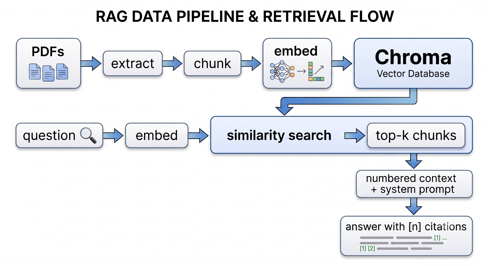

# EU Regulation Assistant

Question answering over EU AI regulation, where every claim is numbered back to the
passage it came from.

**[Live demo](https://domainragassistant-production.up.railway.app/)** · Built with Python, Chroma, OpenAI,
FastAPI, Streamlit, Docker


## What it does

Ask a question about EU AI regulation and get an answer built only from the indexed
documents, with a citation on every factual sentence. Open any citation to read the
original passage and check the claim yourself.

When the documents do not contain the answer, it says so rather than guessing — including
when the question assumes something the regulation does not say.

**Indexed corpus:** the_digital_service_act_2022.pdf, GDPR_2016


---

## Why the citations matter

A RAG system that produces fluent, confident, unsupported prose is worse than no system
at all in a regulatory context — it is wrong in a way that is expensive to detect. Three
things in this build exist to make that failure visible:

- Every factual sentence carries a `[n]` marker tied to a specific document and page.
- The UI shows the **full retrieved passage**, not a preview, so a claim can be checked
  without leaving the page.
- The system is instructed to refuse rather than assemble an answer from loosely related
  material, and refusal behaviour is measured, not assumed.

---

## Architecture



| Stage | Choice | Reasoning |
|---|---|---|
| Extraction | pdfplumber, page by page | Page numbers are carried through the whole pipeline so citations resolve to something a reader can verify. |
| Chunking | Fixed token windows, 500/80 overlap, within page boundaries | Chunks never span pages, so every chunk has exactly one page number. Costs a little context at page seams; buys citation precision. |
| Embedding | `text-embedding-3-small`, batched | One config constant is read by both ingestion and query, so the two cannot silently diverge into different vector spaces. |
| Vector store | Chroma, cosine space, persistent | Cosine is set explicitly at collection creation — Chroma's default is L2, which ranks differently. |
| Generation | `gpt-4o-mini`, temperature 0 | Extraction task, not a creative one. The same excerpts must produce the same answer, or the evaluation is not repeatable. |

<!-- TODO: replace the ASCII diagram with a real one (Excalidraw → PNG, or a
     Mermaid block, which GitHub renders natively). It reads better and takes
     ten minutes. -->

---

## Results

Evaluated on **NN hand-written question/answer pairs** covering four question types plus
unanswerable controls. The test set was written by hand rather than generated: questions
produced by a model from the corpus inherit the corpus's vocabulary, which is exactly the
case retrieval already handles well.

<!-- TODO: fill from eval/results/*.json once the RAGAS run completes.
     Delete any row you do not have a real number for. Do not estimate. -->

| Metric | Baseline | After *(change)* | Δ |
|---|---|---|---|
| Context recall | — | — | — |
| Context precision | — | — | — |
| Faithfulness | — | — | — |
| Response relevancy | — | — | — |
| Page-match recall@5 | 0.93 | — | — |
| Refusal rate (unanswerable) | 1.00 | — | — |

**Refusal rate 5/5.** On unanswerable questions and false-premise questions — including
one asking which article bans AI in agriculture, which does not exist — the system
declined and named what was missing rather than inventing a provision.

**Page-match recall@5 = 0.93** is computed without an LLM judge: each test question
records the page where the answer actually lives, and the check is simply whether a chunk
from that page (±1) appeared in the retrieved set. It exists as a control on the
LLM-judged metrics — when a deterministic check and a model's judgement disagree, one of
them is wrong and it is worth knowing which.

### The experiment

<!-- TODO: write this after step 8. Structure:
     - what you changed and why you expected it to help
     - what moved, what didn't
     - 2-3 specific questions that flipped, with the retrieved pages before/after
     If the change made things worse, say so and explain the diagnosis. A
     documented negative result reads as more senior than a clean win. -->

---

## Running it

```bash
git clone https://github.com/YOUR-USERNAME/legal-rag
cd legal-rag

python -m venv .venv && source .venv/bin/activate
pip install -r requirements.txt

cp .env.example .env        # add your OPENAI_API_KEY

# add PDFs to corpus/, then build the index
python src/ingest.py

streamlit run src/app.py
```

**Docker:**

```bash
docker build -t legal-rag .
docker run -p 8501:8501 -e OPENAI_API_KEY=$OPENAI_API_KEY legal-rag
```

The image ships with a pre-built index rather than embedding at startup — re-embedding on
every container start costs money and minutes on each restart and cold boot. The trade-off
is that the container cannot re-index itself; `corpus/` is excluded from the image
entirely.

**API:**

```bash
uvicorn api:app --reload --app-dir src   # http://localhost:8000/docs
```

`POST /query` returns the answer, sources with page numbers, latency, and cost per query.
`GET /health` reports chunk count and both model names — the most confusing possible
failure is an index built with one embedding model being queried with another, which
produces quietly wrong results rather than an error.

---

## Evaluation

```bash
python eval/run_eval.py --limit 3 --no-ragas   # free, checks the plumbing
python eval/run_eval.py --label baseline       # full run
python eval/compare.py results/A.json results/B.json
```

Every results file records the config that produced it — chunk size, overlap, top-k, both
model names, and the judge model. A score without its config is not reproducible, and the
before/after comparison would mean nothing.

---

## Limitations

- **Not legal advice.** A retrieval system over regulatory text, nothing more.
- **No OCR.** Scanned PDFs without a text layer are skipped at ingestion.
- **English only**, and only the documents listed above. Questions outside that corpus are
  refused by design, not answered from the model's general knowledge.
- **Evaluated on NN questions** written by one person. Small, and reflects my own sense of
  what matters in these documents.
- **Chunks do not span page boundaries**, so a provision split across a page break is
  split across chunks. Deliberate — see the architecture table — but it is a real cost.
- **Headers and footers are not stripped.** Repeated boilerplate rides along in every
  chunk, consuming context and slightly compressing the similarity score distribution.
  Measurable as a future experiment.
- **Faithfulness is judged by an LLM**, which has its own error rate. The page-match metric
  is the deterministic control, and it only checks retrieval, not the answer.

---
